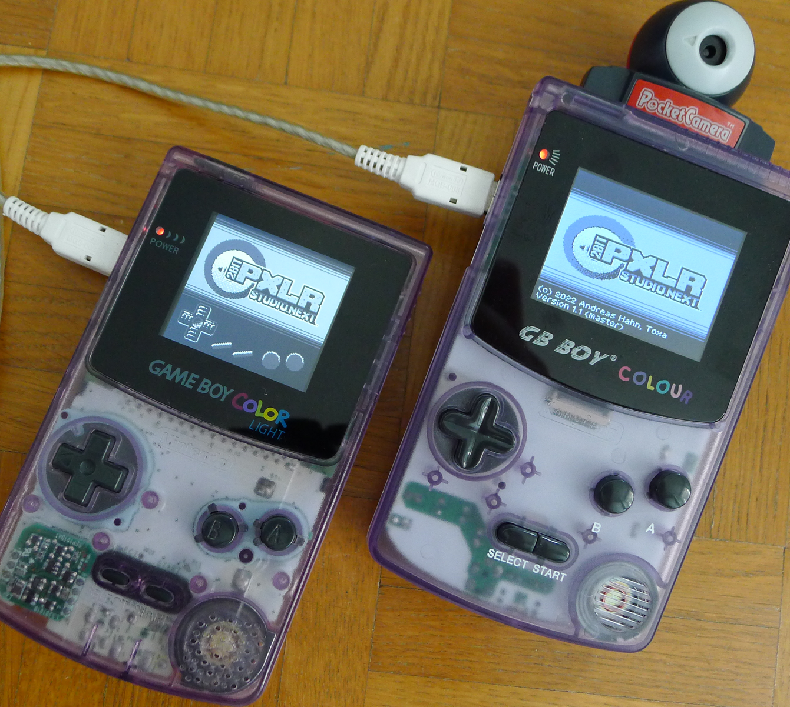

# 2bit PXLR Studio Next

**[The latest release version may be downloaded here](https://github.com/untoxa/2bit-pxlr-studio-next/releases/latest/)**.

This project requires the reflashable Game Boy Camera cart. PCB's and build instructions may be found [here](https://github.com/HDR/Gameboy-Camera-Flashcart/). Additionnaly, a generic flashable cartridge is necessary to remote control the camera via serial cable.

This project is a homebrew enhancing the capabilities of the Game Boy Camera by allowing access to all the possible parameters of the sensor and improving the printing speed and the camera ergonomics in general. This project is compatible with all known models of Game Boy printer and Game Boy printer emulator. The project features Game Boy And Game Boy Color versions.

# 2bit PXLR Studio Next Camera with its serial remote controller


# User Manual

After booting, the user has access to **Camera Mode**, for taking pictures, to **Image Gallery** to view and print pictures and to **Settings**.

## Camera Mode
### Mode menu
- The **Auto Mode** is a mode that mimics the behavior of the stock Game Boy Camera, it modifies automatically the **Exposure time**, and set the **Gain**, **Sensor Voltage Out** and **Edge enhancement mode** according to rules assessed by datalogging the [MAC-GBD/sensor protocol](src/state_camera.c#L147). All others camera  registers used are fixed.
- The **Assisted Mode** uses the same strategy than Auto Mode with a manual setting of the exposure time. 
- The **Manual Mode** allows **modifying all the parameters** of the camera sensor, except registers P, M and X which are not configurable.

### Trigger menu
- **A Button** is the most simple action: press A once to get an **Action**.
- **Timer** launch a remote timer between 1 and 99 seconds and trigger and **Action**. 
- **Repeat** allows triggering and **Action** repetitively, it is cumulative with **Timer**. 

**Timer** and **Repeat** can be cancelled with B button.

### Action menu
- **Save** just save image in one of the 30 memory slots of the Camera save ram. If memory is full, it will display an error sound.
- **Print** sends the image with the chosen border directly to the printer without saving.
- **Save & Print** cumulates the two features but continues to print if the memory slots are all occupied.
- **Transfer** allows fast transmission of one image to the [pico-gb-printer](https://github.com/untoxa/pico-gb-printer).

The **Transfer** protocol is very similar to standard printing. Only two packets are used, and the game boy does not expect receiving anything in response, we just send the raw image data as quick as possible. First, the Game Boy sends the standard printer INIT packet, and then sends the new `0x10` packet that is the same as DATA, but the data length is always 3585 bytes (16x14 tiles) and CRC bytes are always 0. On CGB the transfer rate is 32KB/s, on the DMG the transfer rate is 1KB/s.

- **Transfer REC** allows continuous tranmission to the [pico-gb-printer](https://github.com/untoxa/pico-gb-printer).
- **Save & Transfer** allows fast transmission of one image to the [pico-gb-printer](https://github.com/untoxa/pico-gb-printer) and saving to a memory slot.
- **Pic'n'rec** allows recording one picture on the [InsideGadget's Pic'n'Rec device](https://shop.insidegadgets.com/product/gameboy-camera-picnrec/).
- **Pic'n'rec REC** allows continuous tranmission to [InsideGadget's Pic'n'Rec device](https://shop.insidegadgets.com/product/gameboy-camera-picnrec/) 

### Restore Default menu
- Allow to come back to factory settings, in particular if all is becoming messy in **Manual Mode**.

## Image Gallery
- **Info** displays a thumbnail and the camera registers used. It allows printing these informations too.
- **Print** prints the current displayed image with the chosen border with a clock frequency of 8 kHz (1kB/s) or 26 kHz (32 kB/s) in **Fast Printing** mode (GBC only).
- **Print All** prints all the images in memory with the chosen border with a clock frequency of 8 kHz (1kB/s) or 26 kHz (32 kB/s) in **Fast Printing** mode (GBC only).
- **Transfer** prints the current displayed image without border with a clock frequency of 256 kHz (32kB/s) by default. This mode is supported by the [pico-gb-printer](https://github.com/untoxa/pico-gb-printer). **Compatible witn Game Boy Color only !**
- **Transfer All** prints all the images in memory without border and with a clock frequency of 256 kHz (32kB/s). This mode is supported by the [pico-gb-printer](https://github.com/untoxa/pico-gb-printer). **Compatible witn Game Boy Color only !**
- **Delete** declares the memory slot of the displayed image as free.
- **Delete All** declares all the memory slots as free.
- **Undelete All** declares all the memory slots as containing an image.

## Settings
- **Frame** allows selecting no frame, normal frame or wild frames.
- **Fast Printing** allows switching all print mode from 8 kHz (1 kB/s) to 256 kHz (32 kB/s) by default. **Compatible witn Game Boy Color only !**. This mode is currently supported by the [pico-gb-printer](https://github.com/untoxa/pico-gb-printer) and the [BitBoy](https://gameboyphoto.bigcartel.com/product/bitboy).
- **Alt. SGB borders** allows switching between two Super Game Boy borders.

## About
Just the hall of fames.

# Some technical considerations
The Mitsubishi M64282FP artificial retina is a one of the first mass produced CMOS light sensor. This kind of sensor is known for its good behavior in low light conditions and low power consumption. Basically each pixel of the sensor converts the quantity of photons received during an exposure time into a voltage. The sensor is able to perform some basic arithmetics on the voltage values before transfering them to an analog output (inversion, offsetting, 2D operations, multiplication, etc.). This sensor contains 128x128 pixels but only 123 lines returns image information as the first 5 lines are just composed of [masked pixels](doc/Mitsubishi%20M64282FP_detail%20of%20light%20sensors.png) uses to measure the voltage response of sensor in full darkness. The [sensor documentation](doc/M64282FP-datasheet.pdf) is notorious for being crappy and some informations are deduced from the much better documentation of the [Mitsubishi M64283FP sensor](doc/Mitsubishi%20Integrated%20Circuit%20M64283FP%20Image%20Sensor.pdf) which is an upgrade.

## Effect of the main adressable parameters
The M64282FP is tuned by sending 8 one byte registers to the sensor. The MAC-GBD itself, mapper of the Game Boy Camera, can receive only 5 one byte registers so 3 registers are not modifiable (P, M and X, called **Filtering Kernels**). The mapping between sensor registers and MAC-GBD registers is given [here](include/gbcamera.h#L86).

- The **Exposure Time** (registers C) is the time each pixel of the sensor will receive photons and convert the integral photon quantity to voltage. The longer the exposure time, the higher the output voltage, the higher the signal to noise ratio, but the higher the motion blur. Sensor can saturate for too long exposure time/too high flux of photons. This sensor allows exposure time from 16 µseconds to 1.044 seconds. Exposure times below 256 µseconds lead to strong vertical artifacts. Using varying exposure time creates vertical (low exposure times) and horizontal (high exposure times) artifacts which are intrinsic to the sensor. The total voltage range between dark and saturated sensor is about 2 volts.
- The **Sensor Gain** (register G) is a multiplier applied between the quantity of photons received and the output voltage. To make an analogy with film camera, gain is similar to the ISOs of the film. However calculating the real corresponding ISOs for each gain value is out of reach with the current documentation of the sensor. Like film cameras, high gains (ISOs) and low exposure times gives noisy images, low gains (ISOs) and high exposure times gives smooth images. The gain used in the Game Boy camera rom varies very little compared to what the sensor is able to in Manual Mode.
- The **Sensor Voltage Out** (register O) is a fine bias applied to the output pin. It allows increasing the sensor dynamic. Basically this voltage should exactly compensate the voltage reading of dark pixels so that the sensor output is 0 volts in total darkness. 
- The **Sensor Voltage reference** (register V) is a crude voltage bias applied to the output. It is not modified by the Game Boy Camera (and set by default to 1.5 volts). It typically allows to have a match between the min/max output voltage and the min/max input voltage allowed by the external ADC converter used with the sensor. The M64282FP is able to automatically set the the voltage reading of dark pixels at the **Sensor Voltage reference** via the **Sensor Zero Point** register Z.
- The **Inverse Output** (register I) performs an hardware negative image.
- The **Edge enhancement** is performed by playing on the **Sensor Edge Operation** (register VH), the **Sensor Edge Ratio** (register E) and the **Sensor Edge Exclusive** (register N).

Surprisingly, the **Contrast** is not modified by the sensor itself but is set by the MAC-GBD by using [dithering matrices](src/dither_patterns.c) derived from [Bayer matrices](https://en.wikipedia.org/wiki/Ordered_dithering).

## Remote control packet format

The packet format is very simple and consist of one byte.
```
0bS0IPXXXX  
    S - stop, I - identifier, P - parity, XXXX - 4 Button or D-Pad bits
    Stop bit is always 1.
    Identifier is 1 for upper (buttons) and 0 for lower (D-Pad)
    Parity bit is 1 when the count of 1's in XXXX bits is odd, 0 when even.
```
Sender is a master device for the game boy.

# Fast compiling guide for Windows users 

Basic requirement: 20 minutes without any disturbance.

Download `GBDK-2020` from [here](https://github.com/gbdk-2020/gbdk-2020/actions) under the `GBDK Build and Package` link and unzip it into the desired directory.

Download `Cygwin` built for Windows from [here](https://www.cygwin.com/). Install it with the additional `make` package from `Devel` category.

Download and install `Python 3` built for Windows from [here](https://www.python.org/downloads/).

Download and install `Git` built for Windows from [here](https://git-scm.com/download/win).

Download a Python script from [here](https://bootstrap.pypa.io/get-pip.py), then run from Cygwin in the directory where `get-pip.py` is placed:

    python get-pip.py
    python -m pip install --upgrade pip

Then install Pillow and wave libraries: 

    python -m pip install --upgrade Pillow
    python -m pip install --upgrade wave

Now from the Cygwin terminal, clone this git repository to its desired destination (default is `/home/USER`), but may be any: 

    git clone https://github.com/untoxa/2bit-pxlr-studio-next

Set the `GBDK_HOME` environment variable, which points to the GBDK-2020 folder in the Windows system settings (recommended) or edit the path in the beginning of the `Makefile` in the root of the `2bit-pxlr-studio-next` repository.

Run make from the Cygwin terminal in the project folder containing the `Makefile`: 

    make

Your roms will be in `./build` folders, enjoy ! 

# Resources
- Mitsubishi M64282FP [Sensor Datasheet](doc/M64282FP-datasheet.pdf)
- Mitsubishi M64283FP [Sensor Datasheet](doc/Mitsubishi%20Integrated%20Circuit%20M64283FP%20Image%20Sensor.pdf)
- Game Boy [programming manual](doc/Game%20Boy%20Programming%20Manual.pdf)
- [AntonioND](https://github.com/AntonioND) for the outstanding [Documentation regarding the camera's sensor](https://github.com/AntonioND/gbcam-rev-engineer) / [PDF](https://github.com/AntonioND/gbcam-rev-engineer/blob/master/doc/gb_camera_doc_v1_1_1.pdf)

# Author contribution
- [Toxa](https://github.com/untoxa) and [Andreas Hahn](https://github.com/HerrZatacke) lead programmers. 
- [@rembrandx](https://www.instagram.com/rembrandx/) for the Logo/Splashcreen 
- [Raphaël Boichot](https://github.com/Raphael-Boichot/) for the in-depth analysis of the [Game Boy Camera's RAM structure](https://github.com/Raphael-Boichot/Inject-pictures-in-your-Game-Boy-Camera-saves)
- [Christian Reinbacher](https://github.com/reini1305) for the [print function](https://github.com/HerrZatacke/custom-camera-rom/commit/5976b47e6b6d577c954e2b678affa9925824f5b5) and general help with some C concepts
- [Alex (insidegadgets)](https://github.com/insidegadgets) for figuring out the flickering issue and more
- [All the folks from Game Boy Gamera Club Discord](https://discord.gg/C7WFJHG) for their support and ideas
