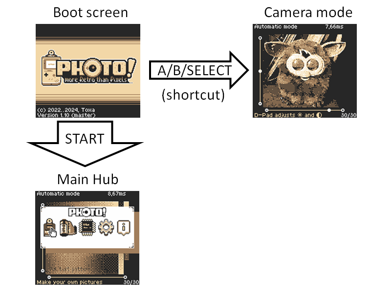

<svg id="PHOTO_HD" data-name="PHOTO! HD" xmlns="http://www.w3.org/2000/svg" viewBox="0 0 350.88 93.37"><defs><style>.cls-1{fill:#000007;}.cls-1,.cls-10,.cls-11,.cls-12,.cls-13,.cls-15,.cls-2,.cls-3,.cls-4,.cls-5,.cls-6,.cls-7{fill-rule:evenodd;}.cls-2{fill:#f28a14;}.cls-3{fill:#e41d0c;}.cls-4{fill:#76232f;}.cls-5{fill:#14a0d3;}.cls-6{fill:#1571b9;}.cls-7{fill:#113b5e;}.cls-10,.cls-8{fill:#e2e2e2;}.cls-9{fill:#c3c7ba;}.cls-11,.cls-14{fill:#585868;}.cls-12{fill:#3aaf70;}.cls-13{fill:#007673;}.cls-15{fill:#fff;}</style></defs><g id="PHOTO_Icon_HD" data-name="PHOTO Icon HD"><g id="PHOTO_" data-name="PHOTO!"><g id="Photo_Font_Color" data-name="Photo Font Color"><path class="cls-1" d="M342.29,7c-6.65-1.28-12-1-18.71-1.43-5.51-.36-9.81,5-10.86,10.34-.46,2.39-.57,3.39-1.05,7.62-5.33-9.2-10.73-11.4-18.94-11.4h-89.1c-3.33,0-7-.63-9.56.78a8.06,8.06,0,0,1-3,1.22A46,46,0,0,0,133,12.87H82.45C71.51,12.87,69,12.72,65,15.21c-2.33-2.35-9-2.4-11.77-2.4-9,0-50.12-.45-50.12-.45v71.8h32.4V67.62S56.14,69.05,65.33,65v19.4c19.46,0,48.89.1,68.23,0a46,46,0,0,0,60.69-4.74c2.58-1,7.35-1.62,9.57.5,0,3.76.55,4.51.55,4.51h32l.51-5.45s6.91-4.77,10.53.46c2.78,4,12.68,5,18.93,5l29.13,0c3.59,0,7.78-.62,10.7-2.87.87-.66.5.07,3.67,5,2.86,4.47,8.23,7.51,12.1,6.49,5.59-1.47,7-3.72,8.11-8.27,1.23-3.25.62-6.27-.25-10.15,2.32-3.92,3.77-3.16,5.86-9.21,6.5-18.88,9-25.44,14.34-41.39C352.49,16.86,351.06,8.71,342.29,7Z" transform="translate(-1.68 -1.73)"/></g><g id="_" data-name="&quot;!&quot;"><g id="_Color_Highlight" data-name="&quot;!&quot; Color Highlight"><path class="cls-2" d="M341.91,11.4c-6.65-1.49-9.71-2-14.54-2.92-6.46-1.21-9.52,1.8-9.67,8.33-.16,7.18,0,14.37,0,21.55,0,7.66-.05,15.32,0,23a9.92,9.92,0,0,0,1,3.8c1.07,2.18,4.8,3.46,7,3.22s5.34-2.64,6-4.66c6.82-20.38,6.66-20.68,14.38-42.85C347.21,17.67,346.48,12.41,341.91,11.4Zm-23.17,63a7.19,7.19,0,1,0,7.48,6.46A7.12,7.12,0,0,0,318.74,74.41Z" transform="translate(-1.68 -1.73)"/></g><g id="_Color" data-name="&quot;!&quot; Color"><path class="cls-3" d="M318.74,75.87a7.19,7.19,0,1,0,7.48,6.46A7.11,7.11,0,0,0,318.74,75.87Zm23.17-63c-6.65-1.48-9.71-2-14.54-2.91-6.46-1.21-9.52,1.8-9.67,8.33-.16,7.18,0,14.36,0,21.55,0,7.66-.05,15.32,0,23a9.92,9.92,0,0,0,1,3.81c1.07,2.18,4.8,3.46,7,3.21s5.34-2.63,6-4.65c6.82-20.38,6.66-20.68,14.38-42.86C347.21,19.13,346.48,13.87,341.91,12.85Z" transform="translate(-1.68 -1.73)"/></g><g id="_Color_Shadoe" data-name="&quot;!&quot; Color Shadoe"><path class="cls-4" d="M318.74,87.32A7,7,0,0,1,312,80.86a6,6,0,0,0,0,.73,7.15,7.15,0,1,0,14.26-.65A6.91,6.91,0,0,1,318.74,87.32ZM317.67,36.9c0-3.51,0-7-.05-10.53,0,3.88,0,7.77,0,11.65C317.66,37.65,317.67,37.27,317.67,36.9Zm28.85-19.6a8.51,8.51,0,0,1-.42,2.09c-7.72,22.17-7.56,22.47-14.38,42.85-.68,2-3.81,4.41-6,4.66s-6-1-7-3.21a10,10,0,0,1-1-3.81c0-3.75,0-7.49,0-11.24q0,6.34,0,12.7a9.92,9.92,0,0,0,1,3.8c1.07,2.18,4.8,3.46,7,3.22s5.34-2.64,6-4.66c6.82-20.38,6.66-20.68,14.38-42.85A8.93,8.93,0,0,0,346.52,17.3Z" transform="translate(-1.68 -1.73)"/></g></g><g id="Photo_Font" data-name="Photo Font"><g id="Photo_Font_Highlight" data-name="Photo Font Highlight"><path class="cls-5" d="M54.65,17.16H6.89V79.44h23V62.91s15.16.11,22.24,0c6.33-.13,11.61-4.94,11.77-10.91.22-8.13.19-16.27,0-24.4C63.75,23,58.9,17.16,54.65,17.16ZM30.08,50.76V28.82c11,0,11,.45,11,12.67C41.1,49.76,40,50.76,30.08,50.76ZM194.47,34.42h14.86V79.67l22.88.09-.07-45.35h10.69l.07-17.48-48.36,0ZM306.22,28.6c-.06-6.32-5-11.52-11-11.62-11.35-.18-22.71-.16-34.06,0-7,.09-11.73,5-11.89,12.18-.15,6.19,0,12.39,0,18.59,0,6.68-.11,13.35,0,20C249.41,75.09,254,80,261,80.11q17,.24,34.06,0a11.41,11.41,0,0,0,11.17-11.46Q306.42,48.62,306.22,28.6Zm-23,34.29c0,3.38-1.49,5.47-5.14,5.47s-6-1.58-6-5.45c0-15.17.24-15.95.24-29.39,0-3.49,2.34-4.7,5.76-4.7,3.59,0,5.13,1.05,5.13,5.37ZM103.48,17.32V48.09H92.42l0-16L92,17.44H69.61V79.67l22.95-.06V63.53h11.55v16.3h24V17.32Z" transform="translate(-1.68 -1.73)"/></g><g id="Photo_Font_Color-2" data-name="Photo Font Color"><path class="cls-6" d="M54.65,19.35H6.89V81.63h23V65.1s15.16.11,22.24,0c6.33-.13,11.61-4.94,11.77-10.92.22-8.12.19-16.26,0-24.39C63.75,25.14,58.9,19.35,54.65,19.35ZM30.08,53V31c11,0,11,.44,11,12.67C41.1,52,40,53,30.08,53Zm73.4-33.44V50.27H92.42l0-16L92,19.63H69.61V81.86l22.95-.06V65.72h11.55V82h24V19.51Zm91,17.1h14.86V81.86l22.88.08-.07-45.34h10.69l.07-17.48-48.36,0Zm111.75-5.82c-.06-6.32-5-11.53-11-11.62q-17-.27-34.06,0c-7,.09-11.73,5-11.89,12.17-.15,6.2,0,12.4,0,18.6,0,6.67-.11,13.35,0,20C249.41,77.28,254,82.21,261,82.3q17,.24,34.06,0a11.41,11.41,0,0,0,11.17-11.46Q306.42,50.82,306.22,30.79Zm-23,34.28c0,3.38-1.49,5.48-5.14,5.48s-6-1.59-6-5.45c0-15.18.24-15.95.24-29.39,0-3.49,2.34-4.7,5.76-4.7,3.59,0,5.13,1.05,5.13,5.36Z" transform="translate(-1.68 -1.73)"/></g><g id="Photo_Font_Shadow" data-name="Photo Font Shadow"><path class="cls-7" d="M6.88,79.44h23V77.25h-23Zm45.2-18.75c-7.08.15-22.24,0-22.24,0v2.19s15.16.11,22.24,0c6.33-.13,11.61-4.94,11.77-10.91.12-4.4.16-8.79.15-13.19,0,3.67,0,7.33-.15,11C63.69,55.75,58.41,60.56,52.08,60.69ZM69.61,17.44h0V79.67l22.95-.06V77.42l-22.95.06Zm34.51,43.9H92.57v2.19h11.55Zm-63-21.77c0-.09,0-.17,0-.27,0-12.22-.07-12.67-11-12.67v2.19C40.42,28.82,41.06,29.22,41.09,39.57Zm231.23-6c0-3.49,2.34-4.7,5.76-4.7,3.59,0,5.13,1.05,5.13,5.37V32c0-4.32-1.54-5.37-5.13-5.37-3.42,0-5.76,1.21-5.76,4.7,0,13.44-.24,14.22-.24,29.39,0,0,0,0,0,.05C272.11,47.64,272.32,46.3,272.32,33.52Zm10.89,20.23v0Zm-34-8.2c0-3,0-6,0-9,0,3.39,0,6.79,0,10.19C249.23,46.34,249.24,45.94,249.24,45.55Zm-6.41-13.33H232.14v2.19h10.69l.07-17.48h0ZM104.12,77.65v2.18h24V77.65Zm202.1-11.19a11.41,11.41,0,0,1-11.17,11.46q-17,.24-34.06,0c-7-.1-11.58-5-11.72-12.35-.06-2.71-.07-5.42-.07-8.13,0,3.44,0,6.88.07,10.32C249.41,75.09,254,80,261,80.11q17,.24,34.06,0a11.41,11.41,0,0,0,11.17-11.46q.11-10.56.09-21.12Q306.31,57,306.22,66.46Zm-96.89,11v2.19l22.88.09V77.57Zm0-45.26H194.48v2.19h14.86Z" transform="translate(-1.68 -1.73)"/></g></g><g id="Outline"><path class="cls-1" d="M343.75,5.57a163.53,163.53,0,0,0-20.17-2.89C318.07,2.32,313,6.91,312,12.29c-.47,2.39-.58,4.85-1.06,9.08-5.33-9.19-10-10.67-18.21-10.67h-89.1c-3.33,0-7-.63-9.56.78a8.06,8.06,0,0,1-3,1.22A46,46,0,0,0,133,11.42H82.45C71.51,11.42,69,11.26,65,13.75c-2.33-2.35-9-2.4-11.77-2.4-9,0-51.58-.45-51.58-.45V85.62H35.54V69.08s19.14,1.42,28.33-2.59V85.9c19.46,0,50.35.1,69.69,0a46,46,0,0,0,60.69-4.74c2.58-1,5.89-1.62,8.11.5,0,3.76.55,4.51.55,4.51h34.93l.51-5.46s5.45-4.76,9.07.47c2.78,4,12.68,5,18.93,5l29.13,0c3.59,0,7-.62,10-2.87.87-.67.5,1.53,3.67,6.48,2.86,4.47,9,6,12.83,5A12.55,12.55,0,0,0,331.52,85c1.23-3.25.62-6.27-.25-10.15,2.32-3.92,3.77-3.16,5.85-9.21,6.51-18.88,9-25.44,14.35-41.39C354,16.86,352.52,7.26,343.75,5.57ZM63.85,52c-.16,6-5.44,10.78-11.77,10.91-7.08.14-22.24,0-22.24,0V79.44h-23V17.16H54.65c4.25,0,9.1,5.79,9.2,10.41C64,35.7,64.07,43.84,63.85,52Zm40.27,27.86V63.53H92.57V79.61l-22.95.06V17.44H92l.39,14.63,0,16h11.06V17.32h23.19a47,47,0,0,0-1.84,60c.59.85,1.2,1.69,1.85,2.53ZM161.22,89a40.6,40.6,0,1,1,40.27-40.59A40.43,40.43,0,0,1,161.22,89Zm81.61-54.6H232.14l.07,45.35-22.88-.09V34.41h-3.92a46.68,46.68,0,0,0-8.66-15.94l0-1.52,46.17,0Zm63.39,34.24a11.41,11.41,0,0,1-11.17,11.46q-17,.24-34.06,0c-7-.09-11.58-5-11.72-12.34-.14-6.68,0-13.35,0-20,0-6.2-.12-12.4,0-18.59.16-7.19,4.87-12.09,11.89-12.18,11.35-.15,22.71-.17,34.06,0,6,.1,10.94,5.3,11,11.62Q306.42,48.63,306.22,68.65Zm12.52,20.13a7.2,7.2,0,0,1,0-14.37,7.12,7.12,0,0,1,7.48,6.46A7,7,0,0,1,318.74,88.78ZM346.1,20.85C338.38,43,338.54,43.32,331.72,63.7c-.68,2-3.81,4.41-6,4.66s-6-1-7-3.22a9.92,9.92,0,0,1-1-3.8c-.09-7.66,0-15.32,0-23,0-7.18-.13-14.37,0-21.55.15-6.53,3.21-9.54,9.67-8.33,4.83.91,7.89,1.43,14.54,2.92C346.48,12.41,347.21,17.67,346.1,20.85Zm-316,8V50.76c9.9,0,11-1,11-9.27C41.1,29.27,41,28.82,30.08,28.82ZM137.37,54.89V41.2c-2.69,2-5.68,4.87-7.85,6.46C133.33,51.51,135.76,53.25,137.37,54.89ZM278.08,28.82c-3.42,0-5.76,1.21-5.76,4.7,0,13.44-.24,14.22-.24,29.39,0,3.87,2.47,5.45,6,5.45s5.14-2.09,5.14-5.47V34.19C283.21,29.87,281.67,28.82,278.08,28.82ZM160.86,31.33c-9.25,0-17.11,8.28-17.09,17.2,0,9.32,8.21,17.24,17.07,17.23,9.24,0,17-8.28,17.12-17.21C177.81,39.23,169.71,31.31,160.86,31.33Zm4.28,15.29a2.16,2.16,0,1,1,2.13-2.15A2.14,2.14,0,0,1,165.14,46.62Z" transform="translate(-1.68 -1.73)"/></g></g><g id="PHOTO_Icon" data-name="PHOTO Icon"><g id="Ring_Highlight_2" data-name="Ring Highlight 2"><ellipse class="cls-8" cx="160.21" cy="47.43" rx="37" ry="36.9"/></g><g id="Ring_Base_Color" data-name="Ring Base Color"><ellipse class="cls-9" cx="160.15" cy="49.63" rx="35.81" ry="35.71"/></g><g id="Ring_Highlight" data-name="Ring Highlight"><path class="cls-10" d="M161.13,34.11c-9,0-16.61,7.79-16.6,16.19,0,8.76,8,16.22,16.59,16.2,9,0,16.51-7.79,16.63-16.19C177.61,41.55,169.74,34.09,161.13,34.11Zm4.16,14.39a2,2,0,1,1,2.08-2A2.06,2.06,0,0,1,165.29,48.5Z" transform="translate(-1.68 -1.73)"/></g><g id="Ring_Shadow" data-name="Ring Shadow"><path class="cls-11" d="M161.13,31.85c-9,0-16.61,7.79-16.6,16.19,0,8.76,8,16.22,16.59,16.2,9,0,16.51-7.79,16.63-16.19C177.61,39.29,169.74,31.83,161.13,31.85Zm4.16,14.39a2,2,0,1,1,2.08-2A2.06,2.06,0,0,1,165.29,46.24Z" transform="translate(-1.68 -1.73)"/></g><g id="Base_Higlight" data-name="Base Higlight"><path class="cls-12" d="M161.51,7.76a41,41,0,1,0,41.15,41A41.09,41.09,0,0,0,161.51,7.76Zm.32,77.06a35.71,35.71,0,1,1,35.81-35.71A35.76,35.76,0,0,1,161.83,84.82Z" transform="translate(-1.68 -1.73)"/></g><g id="Base_Color" data-name="Base Color"><path class="cls-13" d="M161.51,10a40.28,40.28,0,1,0,40.4,40.28A40.34,40.34,0,0,0,161.51,10Zm.38,74.54a35.39,35.39,0,1,1,35.49-35.39A35.44,35.44,0,0,1,161.89,84.56Z" transform="translate(-1.68 -1.73)"/></g><g id="Outline-2" data-name="Outline"><path class="cls-1" d="M161.14,1.74A46.68,46.68,0,1,0,208,48.42,46.74,46.74,0,0,0,161.14,1.74Zm.35,87.66a40.63,40.63,0,1,1,40.74-40.63A40.68,40.68,0,0,1,161.49,89.4Z" transform="translate(-1.68 -1.73)"/></g><g id="Arrow"><g id="arrow_higlight" data-name="arrow higlight"><path class="cls-10" d="M133.15,49.63c3.4,3.41,5.58,4.95,7,6.4V43.91C137.77,45.65,135.09,48.22,133.15,49.63Z" transform="translate(-1.68 -1.73)"/></g><g id="arrow-2" data-name="arrow"><path class="cls-11" d="M133.15,48.12c3.4,3.41,5.58,5,7,6.4V42.41C137.77,44.15,135.09,46.72,133.15,48.12Z" transform="translate(-1.68 -1.73)"/></g></g><g id="Iris"><g id="black"><path class="cls-1" d="M161.19,33.66A15.73,15.73,0,0,0,145.9,48.9a15.74,15.74,0,0,0,15.28,15.25c8.27,0,15.21-7.33,15.32-15.24C176.37,40.66,169.12,33.65,161.19,33.66ZM165,47.2a1.91,1.91,0,1,1,1.92-1.9A1.91,1.91,0,0,1,165,47.2Z" transform="translate(-1.68 -1.73)"/></g><g id="Shine"><ellipse class="cls-14" cx="162.85" cy="44.05" rx="4.9" ry="4.89"/></g><g id="Higlight"><path class="cls-15" d="M165.78,42.63a1.91,1.91,0,1,0,1.91,1.91A1.92,1.92,0,0,0,165.78,42.63Z" transform="translate(-1.68 -1.73)"/></g></g></g></g></svg>

**[The latest release version may be downloaded here](https://github.com/untoxa/gb-photo/releases/latest/)**.

**[More recent builds may be downloaded from the CI](https://github.com/untoxa/gb-photo/actions)** under the "Build and package ROM" link (you must be logged into github to download the build artifacts). Please note, that those are development builds and may not be properly tested and thus contain imcomplete features or bugs, use them on your own risk.

This project is a homebrew enhancing the capabilities of the Game Boy Camera by allowing access to all the possible parameters of the sensor and improving the printing speed and the camera ergonomics in general. This project is compatible with all known models of Game Boy printer and Game Boy printer emulator. The project features Game Boy And Game Boy Color versions.

This project requires a reflashable Game Boy Camera cart. PCB's and building instructions may be found [in this first project](https://github.com/HDR/Gameboy-Camera-Flashcart/) or [in this second one](https://github.com/2BitWizard/GB_Mini_Camera). The two projects are not related and not covered by the same license so read carefully the disclaimers before choosing one. Both require advanced skill in soldering and are not recommended for beginners. [GBxCart flasher from InsideGadget](https://www.gbxcart.com/) is the only device compatible with these flashcarts. A generic flashable cartridge is also necessary if you plan to remote control the camera via serial cable.

The save format used here is retro-compatible with any version of the Game Boy Camera rom. This means that you can switch between roms while keeping the same save without loosing your precious images and data. Technically all camera parameters are stored in various empty area of the camera working ram. They do not interfere with a regular camera rom as all checksums are systematically verified.

Photo! is also compatible with [mBGA](https://mgba.io/), [SameBoy](https://sameboy.github.io/) and [PizzaBoy](https://play.google.com/store/apps/details?id=it.dbtecno.pizzaboypro&hl=fr&gl=US) among other non yet tested emulators.

# Photo! with its serial remote controller


Example of use: Photo! working on a GB Boy Colour and remotely controlled from a Game Boy Color with a serial cable.

# User Manual in brief

The repo contains two sets of roms. One set is compiled for DMG Game boy and Game Boy Pocket and basically features same slow transfer rate and a default "color" palette, as the original camera. The set compiled for Game Boy Color is able to feature Double Speed Mode, very high baudrate transfer mode and features several palettes. The two sets come with a remote control rom allowing to use another Game Boy as controller via the serial cable. You can flash the remote control rom on any flashable cart, it will be compatible. 

## Main hub



The **main hub** brings you to the 5 main menus by pressing START after boot. You can skip it and going directly to **Camera Mode** by pressing A/B/SELECT.

- The **Camera mode** is where you take photos. It features 3 different mode for image capturing (see next section).
- The **Gallery** is your main image viewer/printer/eraser, dealing with images stored into ram. It features the same options as the Gallery of the Game Boy Camera. It is natively limited to 30 images.
- The **Flash storage** is a local mass storage system for images. Photo! is a 128kB rom and the MAC-GBD allows dealing with 1MB roms. All space after the 128kB of rom are writable by Photo! to store camera rolls. It allows storing 7 rolls of 30 images into flash memory, increasing the total number of images stored in Photo! to 240 (30 in ram, 210 in flash memory).
- The **Settings** menu features general parameters like palettes, Double Speed Mode, SGB borders, etc.
- The **Credits** features... the credits to the Photo! authors, artists, coders, debuggers.

## Camera Mode


The **camera mode** was created to propose many more features than a regular camera like infinite time-lapse, ultra-fast transmission, full manual mode, support of third party devices, etc. It was polished by people passionate by the Game Boy Camera.

### Capture Mode menu
- The **Auto Mode** is a mode that mimics the behavior of the stock Game Boy Camera, it modifies automatically the **Exposure time**, and sets the **Gain**, **Sensor Voltage Out** and **Edge enhancement mode** according to rules assessed by datalogging the [MAC-GBD/sensor protocol](src/state_camera.c#L147). All other camera registers used are fixed.
- The **Assisted Mode** uses the same strategy than Auto Mode with a manual setting of the exposure time.
- The **Manual Mode** allows **modifying all the parameters** of the camera sensor that can be sent to the MAC-GBD. Glitches in perspective !

### Trigger menu
- **A Button** is the most simple action: press A once to get an **Action**.
- **Timer** launch a remote timer between 1 and 99 seconds and trigger an **Action**.
- **Repeat** allows triggering an **Action** repetitively, it is cumulative with **Timer**.
- **EAB mode** (for Automatic Exposure Bracketing) is an automatic burst mode were each image has a different exposure. You can choose the number of **Steps** (for example 14 steps means 14 images gradually under-exposed + 14 images gradually over-exposed + a central image, so 29 images taken in total) and the maximal possible **Range** possible in EV (indicated here for 29 images). The more you take images, the farther it goes in EV. Images can be processed together to make and HDR image (**H**igh **D**efinition **R**ange) by using the [pico-gb-printer](https://github.com/untoxa/pico-gb-printer), the [Game Boy Camera Gallery](https://herrzatacke.github.io/gb-printer-web/#/home) or the [GB Camera Android Manager](https://github.com/Mraulio/GBCamera-Android-Manager).

**Timer**, **Repeat** and **EAB mode** can be cancelled by pressing B button.

### Action menu
- **Save** just saves image in one of the 30 memory slots of the Camera save ram. If memory is full, it will play an error sound but continues to loop.
- **Print** sends the image with the chosen border directly to the printer without saving.
- **Save & Print** cumulates the two features but continues to print if the memory slots are all occupied.
- **Transfer** allows fast transmission of one image to the [pico-gb-printer](https://github.com/untoxa/pico-gb-printer).

The **Transfer** protocol is very similar to standard printing. Only two packets are used, and the Game Boy does not expect receiving anything in response, we just send the raw image data as quick as possible. First, the Game Boy sends the standard printer INIT packet, and then sends the new `0x10` packet that is the same as DATA, but the data length is always 3584 bytes (16x14 tiles) and CRC bytes are always 0. On CGB the transfer rate is 32KB/s, on the DMG the transfer rate is 1KB/s.

- **Transfer REC** allows continuous transmission to the [pico-gb-printer](https://github.com/untoxa/pico-gb-printer).
- **Save & Transfer** allows fast transmission of one image to the [pico-gb-printer](https://github.com/untoxa/pico-gb-printer) and saving to a memory slot.
- **Pic'n'rec** allows recording one picture on the [InsideGadget's Pic'n'Rec device](https://shop.insidegadgets.com/product/gameboy-camera-picnrec/). This action **is not compatible with the Double Speed Mode**.
- **Pic'n'rec REC** allows continuous transmission to [InsideGadget's Pic'n'Rec device](https://shop.insidegadgets.com/product/gameboy-camera-picnrec/). This action **is not compatible with the Double Speed Mode**.

### Exp. area menu
- Allows varying the area of image where exposure is calculated in **Auto Mode**. Can be centred, left, right, top or bottom. 

### Restore Default menu
- Allows to come back to factory settings, in particular if situation is becoming messy in **Manual Mode**.

## Gallery


The **Gallery** acts as the regular camera gallery but proposes batch image erase/unerase, displaying the image parameters and many printing options compatible with basically all the printer emulators available on the market. It of course can print on the original one !

- **Info** displays a thumbnail and the camera registers used. It allows printing these informations too.
- **Print** prints the current displayed image with the chosen border at a clock frequency of 8 kHz (1kB/s) or 256 kHz (32 kB/s) in **Fast Printing** mode (GBC only).
- **Print All** prints all the images in memory with the chosen border at a clock frequency of 8 kHz (1kB/s) or 256 kHz (32 kB/s) in **Fast Printing** mode (GBC only).
- **Transfer** prints the current displayed image without border at a clock frequency of 256 kHz (32kB/s) by default. This mode is supported by the [pico-gb-printer](https://github.com/untoxa/pico-gb-printer). **Compatible with Game Boy Color only !**
- **Transfer All** prints all the images in memory without border and with a clock frequency of 256 kHz (32kB/s). This mode is supported by the [pico-gb-printer](https://github.com/untoxa/pico-gb-printer). **Compatible with Game Boy Color only !**
- **Delete** declares the memory slot of the displayed image as free (without erasing data).
- **Delete All** declares all the memory slots as free (without erasing data).
- **Undelete All** declares all the memory slots as containing an image (whatever the slots content).


You can access a thumbnail viewer by pressing A when viewing an image. It allows batch selecting, erasing, printing and transfering images.

## Flash Storage


The **flash storage** of images is a unique feature from Photo! It allows dumping the whole ram (a "roll") to dedicated areas (the "slots") in the flash memory after the 128 kB of rom. It is intended to be used as film storage in case you do not have a printer with you. 7 storage slots of 30 images capacity are available in total. In the main menu, just choosing a full slot by pushing A allows browsing, printing, restoring to ram and transfering its images. The [Game Boy Camera Gallery](https://herrzatacke.github.io/gb-printer-web/#/home) and the [GB Camera Android Manager](https://github.com/Mraulio/GBCamera-Android-Manager) are able to directly get the images from a rom dump without moving them into ram. The [pico-gb-printer](https://github.com/untoxa/pico-gb-printer) is also able to get a roll directly without moving it to ram.

- **Save roll to slot** is the action of dumping the whole ram (roll) to a flash memory slot. **Its does not erase the pictures from ram.**
- **Move roll to slot** do the same as **Save roll to slot** but **it wipes all images from ram.**
- **Load from slot** moves all the images contained in one slected slot to the sram. Beware, it wipes all the preceding images on ram !
- **Erase slot** well, erases a selected slot. Image are still recoverable with a dedicated tool in case of mistake.
- **Print slot** sends the whole roll in slot to any GB printer compatible device.
- **Transfer slot** sends the whole roll in slot to the [pico-gb-printer](https://github.com/untoxa/pico-gb-printer) at high baudrate. **Compatible with Game Boy Color only !**
- **Clear roll** erases the current roll (the ram). So **Save roll to slot** + **Clear roll** = **Move roll to slot.**

## Settings


Some fancy general parameters like palette, Super Game Boy borders, regular and wild borders, GBA SP mode, overclocking, etc.

- **Frame** allows selecting no frame, normal frame or wild frames. Made by passionate pixel artists. Try'm all !
- **Palette** proposes a choice of fancy palettes for the Game Boy Color and Game Boy Advance.
- **Fast printing** allows switching all print mode from 8 kHz (1 kB/s) to 256 kHz (32 kB/s) by default. **Compatible witn Game Boy Color only !**. This mode is currently supported by the [pico-gb-printer](https://github.com/untoxa/pico-gb-printer) and the [BitBoy](https://gameboyphoto.bigcartel.com/product/bitboy).
- **Alt. SGB borders** allows switching between two Super Game Boy borders. Compatible with PAL and NTSC Super NES !
- **Show screen grid** displays crosses following the rule of thirds.
- **Save confirmation** adds or removes the double A input to save an image. Without save confirmation, camera acts like a burst mode. With save confirmation, like a real Game Boy Camera.
- **IR remote** enables using the IR port to trigger image capture. Any IR emitting device (TV remote control, other Game Boy Color, IR LED) does the job !
- **Quick Boot** shunts any boot screen and drive you immediately to the **Camera mode**. Ideal for sneak attack !
- **Flip live image** reverses the screen so that image appears in correct orientation when using a GBA SP, without the need for any additionnal device.
- **Double speed** enables the Game Boy Color Double Speed Mode where everything goes twice faster (internal clock, printing, screen refreshing, inputs, etc.). This mode draws more current, avoid this when using a modded Game Boy Pocket. This mode also drives the sensor twice faster, so exposure times are all divided by 2. **Important note: the Double Speed Mode is not reliably supported by the Pic'n'rec REC at the moment**.
- **Display exposure** indicates the exposure time of the sensor in **Auto mode**.
- **Enable DMA** improves live view and refresh rate in **Game Boy Color only.**

## Some technical considerations
The Mitsubishi M64282FP artificial retina is one of the first mass produced CMOS light sensor. This kind of sensor is known for its good behavior in low light conditions and low power consumption. Basically each pixel of the sensor converts the quantity of photons received during an exposure time into a voltage. The sensor is able to perform some basic arithmetics on the voltage values before transfering them to an analog output (inversion, offsetting, 2D operations, multiplication, etc.). This sensor contains 128x128 pixels but only 123 lines returns image information as the first 5 lines are just composed of masked pixels uses to measure the voltage response of sensor in full darkness. The [sensor documentation](doc/M64282FP-datasheet.pdf) is notorious for being crappy and some informations are deduced from the much better documentation of the [Mitsubishi M64283FP sensor](doc/Mitsubishi%20Integrated%20Circuit%20M64283FP%20Image%20Sensor.pdf) which is an upgrade.

## Effect of the main adressable parameters
The M64282FP working parameters are set by 8 bytes (plus their 3-bits addresses) containing various registers. The MAC-GBD itself, mapper of the Game Boy Camera, can only receive 5 bytes of data to tune the sensor so 3 equivalent-bytes of data are not modifiable on the Game Boy Camera (more precisely P, M and X, 3x8 bits, registers also called **Filtering Kernels** are never modified). The mapping between sensor registers and MAC-GBD registers is given [as comment in the project code](include/gbcamera.h#L86). Here is a detailed description of the registers that can be modified:

- The **Exposure Time** (registers C, 16 bits) is the time that each pixel of the sensor will receive photons and convert the integral photon quantity to voltage. The longer the exposure time, the higher the output voltage, the higher the signal to noise ratio, but the higher the motion blur. Sensor can saturate for too long exposure time/too high flux of photons. This sensor allows exposure time from 16 µseconds to 1.044 seconds. Exposure times below 256 µseconds lead to strong vertical artifacts. Using varying exposure time creates vertical (low exposure times) and horizontal (high exposure times) artifacts which are intrinsic to the sensor. The total voltage range between dark and saturated sensor is about 2 volts.
- The **Sensor Gain** (register G, 5 bits) is a multiplier applied between the quantity of photons received and the output voltage. To make an analogy with film camera, gain is similar to the ISOs of the film. However calculating the real corresponding ISOs for each gain value is out of reach with the current documentation of the sensor. Like film cameras, high gains (ISOs) and low exposure times gives noisy images, low gains (ISOs) and high exposure times gives smooth images. The gain used in the Game Boy camera rom varies very little compared to what the sensor is able to in Manual Mode.
- The **Sensor Voltage Out** (register O, 6 bits) is a fine bias applied to the output pin. It allows increasing the sensor dynamic. Basically this voltage should exactly compensate the voltage reading of dark pixels so that the sensor output is 0 volts in total darkness. Game Boy Camera just uses it as a supplementary degree of freedom.
- The **Sensor Voltage Reference** (register V, 3 bits) is a crude voltage bias applied to the output. It is not modified by the Game Boy Camera (and set by default to 1.5 volts). It typically allows to have a match between the min/max output voltage and the min/max input voltage allowed by the external ADC converter used with the sensor. The M64282FP is able to automatically set the the voltage reading of dark pixels at the **Sensor Voltage Reference** via the **Sensor Zero Point** register Z.
- The **Inverse Output** (register I, 1 bit) performs an hardware negative image.
- The **Edge enhancement** is performed by playing on the **Sensor Edge Operation** (register VH, 2 bits), the **Sensor Edge Ratio** (register E, 4 bits) and the **Sensor Edge Exclusive** (register N, 1 bit). It drastically improves the sharpness of the sensor image which is natively very soft without this feature.
Surprisingly, the **Contrast** is not modified by the sensor itself but is set by the MAC-GBD by sending [dithering matrices](src/dither_patterns.c) derived from [Bayer matrices](https://en.wikipedia.org/wiki/Ordered_dithering).

## Remote control packet format

The packet format is very simple and consist of one byte.
```
0bS0IPXXXX  
    S - stop, I - identifier, P - parity, XXXX - 4 Button or D-Pad bits
    Stop bit is always 1.
    Identifier is 1 for upper (buttons) and 0 for lower (D-Pad)
    Parity bit is 1 when the count of 1's in XXXX bits is odd, 0 when even.
```
Sender is a master device for the game boy.

# Fast compiling guide for Windows users

Basic requirement: 20 minutes without any disturbance.

Download `GBDK-2020` from [here](https://github.com/gbdk-2020/gbdk-2020/actions) under the `GBDK Build and Package` link and unzip it into the desired directory.

Download `Cygwin` built for Windows from [here](https://www.cygwin.com/). Install it with the additional `make` package from `Devel` category.

Download and install `Python 3` built for Windows from [here](https://www.python.org/downloads/).

Download and install `Git` built for Windows from [here](https://git-scm.com/download/win).

Download a Python script from [here](https://bootstrap.pypa.io/get-pip.py), then run from Cygwin in the directory where `get-pip.py` is placed:

    python get-pip.py
    python -m pip install --upgrade pip

If `python` command is not recognized, you will have to manually create its own environment variable. Create a `Path` environment variable which targets your Python installation folder (the one that contains `python.exe`) or if `Path` exists, edit it and copy your Python installation path. Close and reopen Cygwin and get back to previous steps. Using `py` command (more generic call to Python under Windows) instead of `python` will aparently fix the issue but compiler will not be compatible.

Then install Pillow and wave libraries:

    python -m pip install --upgrade Pillow
    python -m pip install --upgrade wave

Now from the Cygwin terminal, clone this git repository to its desired destination (default is `/home/USER`), but may be any:

    git clone https://github.com/untoxa/gb-photo

Create a `GBDK_HOME` environment variable which targets your GBDK-2020 folder in the Windows system settings, close and reopen Cygwin.

Run make from the Cygwin terminal in the project folder containing the `Makefile`:

    make

Your roms will be in `./build` folders, enjoy !

# Resources
- Mitsubishi M64282FP [Sensor Datasheet](doc/M64282FP-datasheet.pdf)
- Mitsubishi M64283FP [Sensor Datasheet](doc/Mitsubishi%20Integrated%20Circuit%20M64283FP%20Image%20Sensor.pdf)
- Game Boy [Pan Docs](https://gbdev.io/pandocs/)
- [AntonioND](https://github.com/AntonioND) for the outstanding [Documentation regarding the camera's sensor](https://github.com/AntonioND/gbcam-rev-engineer) / [PDF](https://github.com/AntonioND/gbcam-rev-engineer/blob/master/doc/gb_camera_doc_v1_1_1.pdf)

# Author contribution
- [Andreas Hahn](https://github.com/HerrZatacke) - original idea. 
- [Toxa](https://github.com/untoxa) lead developer.
- [@rembrandx](https://www.instagram.com/rembrandx/) as well as [NeoRame](https://github.com/NeoRame) and 2bitpit for the logo/splashcreen/artworks. THX [Hatch](https://github.com/hatchman) for your frames and the permission to use and change your graphics (Zebra and PCB)
- [Raphaël Boichot](https://github.com/Raphael-Boichot/) for the in-depth analysis of the [Game Boy Camera's RAM structure](https://github.com/Raphael-Boichot/Inject-pictures-in-your-Game-Boy-Camera-saves).
- [Tronimal](https://tronimal.de/game-boy-music-software/) for the original SFX effects.
- [Cristofer Cruz](https://github.com/cristofercruz) for debugging and feature ideas.
- [bbbbbr](https://github.com/bbbbbr) for support in programming.
- [Christian Reinbacher](https://github.com/reini1305) for the [print function](https://github.com/HerrZatacke/custom-camera-rom/commit/5976b47e6b6d577c954e2b678affa9925824f5b5) and general help with some C concepts.
- [Alex (insidegadgets)](https://github.com/insidegadgets) for figuring out the flickering issue and more.
- [All the folks from Game Boy Gamera Club Discord](https://discord.gg/C7WFJHG) for their support and ideas.
